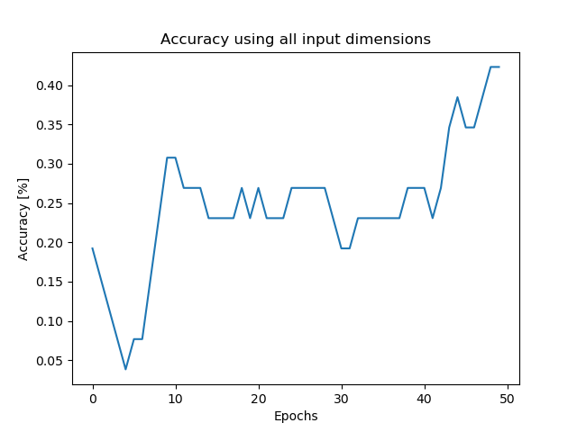
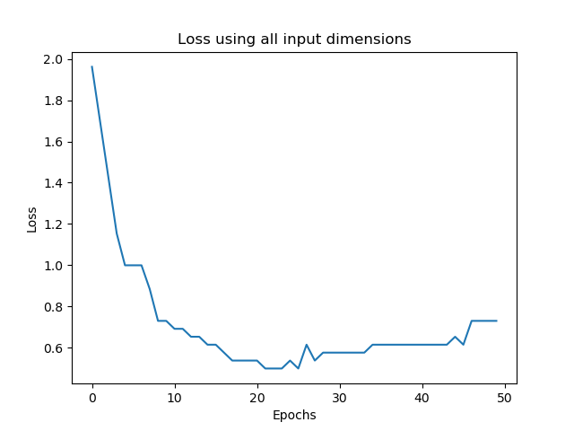
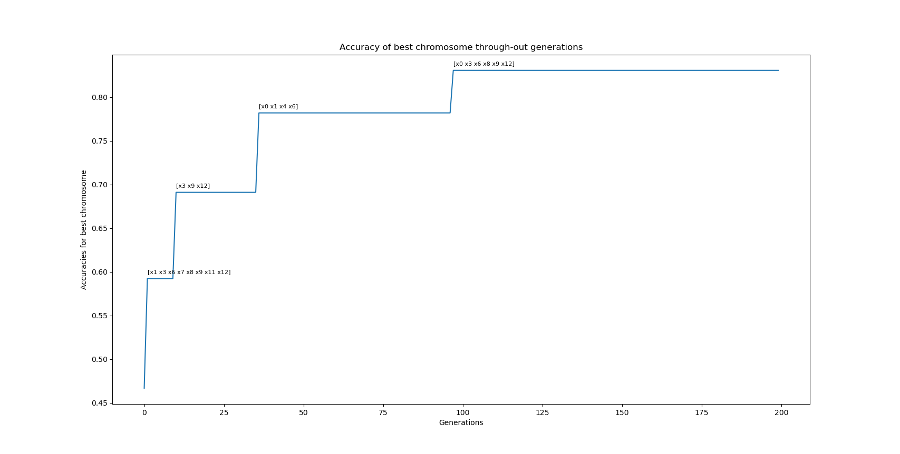

### Genetic-Algorithm-for-Feature-Selection
Optimal feature selection with genetic algorithms on [WINE dataset](https://archive.ics.uci.edu/ml/datasets/wine)

I trained a population for 200 generations to improve the accuracy of a neural network on WINE dataset using feature selection on the input vectors

##

### Neural Network trained for 50 epochs (trying to avoid overfit on small dataset) for baseline reference:

### ***Accuracy***:

### ***Loss***:

##

### Results after 200 Generations of feature selection

